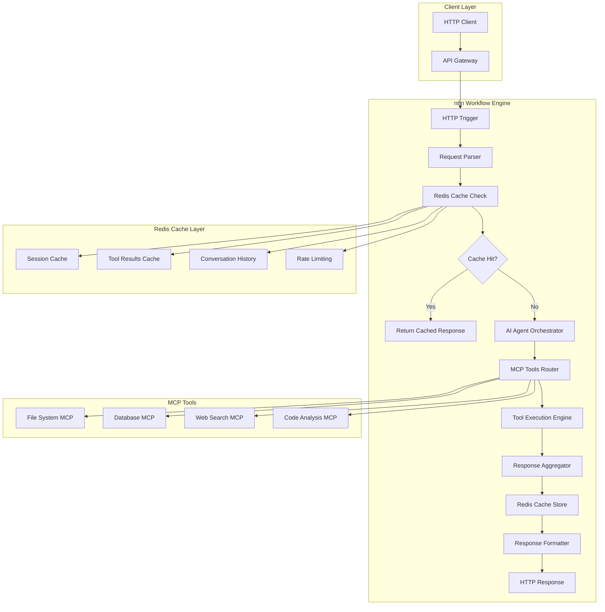

# Advanced AI Agent in n8n with Redis & MCP Tools

A high-performance, scalable AI agent built on n8n workflow automation platform with Redis caching and multiple MCP (Model Control Protocol) tools integration.

## 🚀 Features

- **Advanced AI Orchestration**: Intelligent tool selection and execution
- **Redis Caching**: Multi-layer caching for optimal performance
- **MCP Tools Integration**: File system, database, web search, and code analysis
- **n8n Workflow Automation**: Visual workflow design and execution
- **High Performance**: Optimized for speed and scalability
- **Real-time Monitoring**: Comprehensive logging and health checks
- **Docker Support**: Easy deployment with containerization

## 🏗️ Architecture



## 📋 Prerequisites

- Node.js 16+ and npm
- Redis 6+
- n8n (will be installed automatically)
- Docker (optional, for containerized deployment)

## 🛠️ Installation

### Quick Start

1. **Clone the repository**
   ```bash
   git clone https://github.com/your-org/n8n-advanced-ai-agent.git
   cd n8n-advanced-ai-agent
   ```

2. **Run the setup script**
   ```bash
   npm run setup
   ```

3. **Start Redis**
   ```bash
   redis-server
   ```

4. **Start n8n**
   ```bash
   npm run n8n:start
   ```

5. **Import the workflow**
   - Open n8n at http://localhost:5678
   - Import `n8n-workflows/advanced-ai-agent.json`

### Manual Installation

1. **Install dependencies**
   ```bash
   npm install
   ```

2. **Create environment file**
   ```bash
   cp .env.example .env
   # Edit .env with your configuration
   ```

3. **Start services**
   ```bash
   # Start Redis
   redis-server
   
   # Start n8n
   n8n start
   
   # Start AI Agent
   npm start
   ```

## 🐳 Docker Deployment

### Using Docker Compose

```bash
# Build and start all services
docker-compose up -d

# View logs
docker-compose logs -f

# Stop services
docker-compose down
```

### Individual Containers

```bash
# Build the AI Agent image
docker build -t n8n-ai-agent .

# Run with Redis
docker run -d --name redis redis:7-alpine
docker run -d --name ai-agent --link redis n8n-ai-agent
```

## 📖 Usage

### API Endpoints

#### Process AI Request
```bash
POST /ai-agent
Content-Type: application/json

{
  "message": "Analyze the code in src/index.js",
  "sessionId": "user-session-123",
  "userId": "user-456",
  "conversationId": "conv-789"
}
```

#### Health Check
```bash
GET /health
```

#### Get Conversation History
```bash
GET /conversation/:userId/:conversationId
```

### Example Requests

#### File Analysis
```bash
curl -X POST http://localhost:3000/ai-agent \
  -H "Content-Type: application/json" \
  -d '{
    "message": "Analyze the complexity of src/ai-agent-orchestrator.js",
    "sessionId": "session-123",
    "userId": "user-456"
  }'
```

#### Database Query
```bash
curl -X POST http://localhost:3000/ai-agent \
  -H "Content-Type: application/json" \
  -d '{
    "message": "Query the users table for active users",
    "sessionId": "session-123",
    "userId": "user-456"
  }'
```

#### Web Search
```bash
curl -X POST http://localhost:3000/ai-agent \
  -H "Content-Type: application/json" \
  -d '{
    "message": "Search for latest AI trends",
    "sessionId": "session-123",
    "userId": "user-456"
  }'
```

## 🔧 Configuration

### Environment Variables

```bash
# Redis Configuration
REDIS_HOST=localhost
REDIS_PORT=6379
REDIS_PASSWORD=
REDIS_DB=0

# n8n Configuration
N8N_WEBHOOK_URL=http://localhost:5678/webhook/ai-agent
N8N_API_KEY=your-n8n-api-key

# Logging
LOG_LEVEL=info
LOG_FILE=logs/app.log

# Security
JWT_SECRET=your-jwt-secret-key
API_KEY=your-api-key

# MCP Tools
MCP_FILESYSTEM_ENABLED=true
MCP_DATABASE_ENABLED=true
MCP_WEBSEARCH_ENABLED=true
MCP_CODEANALYSIS_ENABLED=true
```

### Redis Cache Configuration

```json
{
  "host": "localhost",
  "port": 6379,
  "password": null,
  "db": 0,
  "keyPrefix": "ai-agent:",
  "defaultTTL": 3600
}
```

## 🧪 Testing

### Run Tests
```bash
# All tests
npm test

# Watch mode
npm run test:watch

# Coverage report
npm run test:coverage
```

### Test Examples

```bash
# Test file system operations
npm run test:filesystem

# Test database operations
npm run test:database

# Test web search
npm run test:websearch

# Test caching
npm run test:cache
```

## 📊 Monitoring

### Health Check
```bash
npm run health-check
```

### Logs
```bash
# View application logs
tail -f logs/app.log

# View error logs
tail -f logs/error.log

# View combined logs
tail -f logs/combined.log
```

### Metrics
- Request processing time
- Cache hit/miss rates
- Tool execution success rates
- Error rates and types
- Resource usage (CPU, memory, Redis)

## 🔍 MCP Tools

### File System MCP
- File reading and writing
- Directory listing
- Code analysis and complexity calculation
- File search and pattern matching

### Database MCP
- Multiple database support (MySQL, PostgreSQL, SQLite)
- Query execution and optimization
- Table structure analysis
- Database backup and restore

### Web Search MCP
- Web scraping and content extraction
- Search engine integration
- Content analysis and sentiment detection
- Structured data extraction

### Code Analysis MCP
- Static code analysis
- Complexity metrics
- Security vulnerability detection
- Code optimization suggestions

## 🚀 Performance Optimization

### Caching Strategy
- **L1 Cache**: In-memory for frequently accessed data
- **L2 Cache**: Redis for distributed caching
- **Tool Cache**: Individual tool result caching
- **Session Cache**: User session management

### Scalability Features
- Horizontal scaling with multiple n8n instances
- Load balancing support
- Database connection pooling
- Asynchronous tool execution

## 🔒 Security

### Authentication
- API key authentication
- JWT token validation
- Rate limiting per user
- Session management

### Data Protection
- Sensitive data encryption
- PII handling compliance
- Audit logging
- Data retention policies

## 🤝 Contributing

1. Fork the repository
2. Create a feature branch (`git checkout -b feature/amazing-feature`)
3. Commit your changes (`git commit -m 'Add amazing feature'`)
4. Push to the branch (`git push origin feature/amazing-feature`)
5. Open a Pull Request

### Development Setup
```bash
# Install development dependencies
npm install

# Run linting
npm run lint

# Fix linting issues
npm run lint:fix

# Run tests
npm test
```

## 📝 License

This project is licensed under the MIT License - see the [LICENSE](LICENSE) file for details.

## 🙏 Acknowledgments

- [n8n](https://n8n.io/) - Workflow automation platform
- [Redis](https://redis.io/) - In-memory data structure store
- [MCP](https://modelcontextprotocol.io/) - Model Context Protocol
- [Node.js](https://nodejs.org/) - JavaScript runtime

## 📞 Support

- **Documentation**: [docs/](docs/)
- **Issues**: [GitHub Issues](https://github.com/your-org/n8n-advanced-ai-agent/issues)
- **Discussions**: [GitHub Discussions](https://github.com/your-org/n8n-advanced-ai-agent/discussions)
- **Email**: support@your-org.com

## 🔄 Changelog

### v1.0.0
- Initial release
- Basic AI agent functionality
- Redis caching integration
- MCP tools support
- n8n workflow automation
- Docker deployment support

---

**⭐ Star this repository if you find it useful!**