# Advanced AI Agent in n8n with Redis & MCP Tools

## Architecture Overview

### System Components

```mermaid
graph TB
    subgraph "n8n Workflow Engine"
        A[HTTP Trigger] --> B[Request Handler]
        B --> C[Redis Cache Check]
        C --> D{Cache Hit?}
        D -->|Yes| E[Return Cached Response]
        D -->|No| F[AI Agent Orchestrator]
        F --> G[MCP Tools Router]
        G --> H[Tool Execution Engine]
        H --> I[Response Aggregator]
        I --> J[Redis Cache Store]
        J --> K[Response Formatter]
        K --> L[HTTP Response]
    end
    
    subgraph "Redis Cache Layer"
        M[Session Cache]
        N[Tool Results Cache]
        O[Conversation History]
        P[Rate Limiting]
    end
    
    subgraph "MCP Tools Integration"
        Q[File System MCP]
        R[Database MCP]
        S[Web Search MCP]
        T[Code Analysis MCP]
        U[API Integration MCP]
    end
    
    subgraph "AI Processing"
        V[LLM Integration]
        W[Context Management]
        X[Tool Selection Logic]
        Y[Response Generation]
    end
    
    C --> M
    C --> N
    C --> O
    F --> V
    G --> Q
    G --> R
    G --> S
    G --> T
    G --> U
    H --> X
    I --> W
    K --> Y
```



## Core Architecture Components

### 1. n8n Workflow Structure

**Main Workflow: Advanced AI Agent**
- **Trigger**: HTTP Webhook for incoming requests
- **Input Processing**: Request validation and parsing
- **Cache Layer**: Redis integration for performance
- **Agent Orchestration**: AI logic and tool routing
- **MCP Integration**: Multiple tool connectors
- **Response Handling**: Formatting and delivery

### 2. Redis Integration Strategy

**Cache Layers:**
- **Session Cache**: User session management
- **Tool Results Cache**: MCP tool responses
- **Conversation History**: Context preservation
- **Rate Limiting**: Request throttling
- **Configuration Cache**: Agent settings

**Cache Keys Structure:**
```
ai-agent:session:{session_id}
ai-agent:tool:{tool_name}:{request_hash}
ai-agent:conversation:{user_id}:{conversation_id}
ai-agent:rate-limit:{user_id}
ai-agent:config:{agent_id}
```

### 3. MCP Tools Integration

**Core MCP Tools:**
1. **File System MCP**: File operations and code analysis
2. **Database MCP**: Data querying and manipulation
3. **Web Search MCP**: Real-time information retrieval
4. **Code Analysis MCP**: Static analysis and optimization
5. **API Integration MCP**: External service connections

**Tool Selection Logic:**
- Intent classification for tool selection
- Tool capability matching
- Fallback mechanisms
- Tool chaining for complex tasks

### 4. AI Agent Capabilities

**Advanced Features:**
- **Multi-turn Conversations**: Context-aware interactions
- **Tool Orchestration**: Intelligent tool selection and chaining
- **Response Caching**: Performance optimization
- **Error Handling**: Graceful failure recovery
- **Scalability**: Horizontal scaling support

## Implementation Plan

### Phase 1: Foundation Setup
1. n8n environment configuration
2. Redis integration setup
3. Basic HTTP webhook workflow
4. Cache layer implementation

### Phase 2: MCP Integration
1. Core MCP tools setup
2. Tool routing logic
3. Response aggregation
4. Error handling

### Phase 3: AI Agent Enhancement
1. Advanced conversation management
2. Tool orchestration logic
3. Performance optimization
4. Monitoring and analytics

### Phase 4: Production Deployment
1. Security hardening
2. Load balancing
3. Monitoring setup
4. Documentation

## Performance Considerations

### Caching Strategy
- **L1 Cache**: In-memory for frequently accessed data
- **L2 Cache**: Redis for distributed caching
- **Cache Invalidation**: TTL-based and event-driven
- **Cache Warming**: Pre-loading frequently used data

### Scalability
- **Horizontal Scaling**: Multiple n8n instances
- **Load Balancing**: Request distribution
- **Database Sharding**: For high-volume data
- **CDN Integration**: For static assets

### Monitoring
- **Performance Metrics**: Response times, throughput
- **Error Tracking**: Exception monitoring
- **Resource Usage**: CPU, memory, Redis metrics
- **Business Metrics**: User interactions, tool usage

## Security Considerations

### Authentication & Authorization
- API key management
- User session validation
- Rate limiting per user
- Tool access permissions

### Data Protection
- Sensitive data encryption
- PII handling compliance
- Audit logging
- Data retention policies

### Infrastructure Security
- Network isolation
- SSL/TLS encryption
- Regular security updates
- Vulnerability scanning